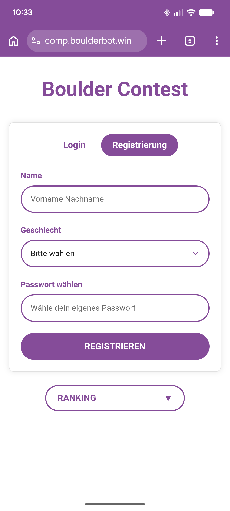
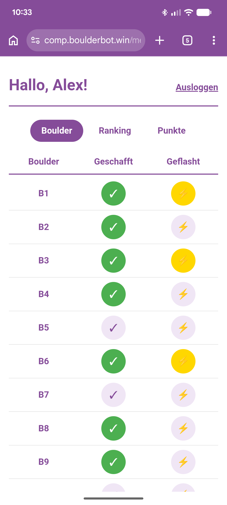
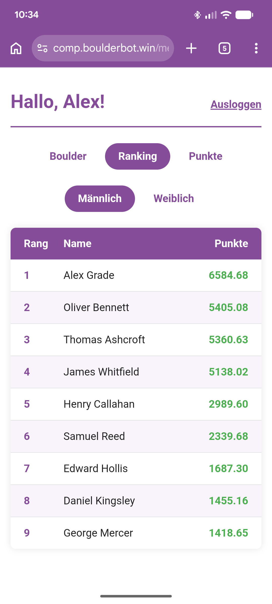
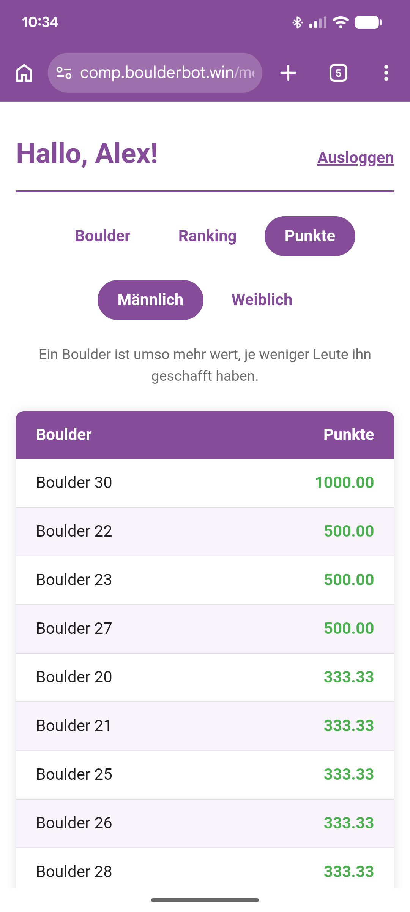

# Relative Boulder Scoring

[](LICENSE)

**Live:** [comp.boulderbot.win](https://comp.boulderbot.win)

Scoring for a bouldering competition on a relative system: a boulder is worth more the
fewer people have sent it. Competitors log their own ascents from their phones, and the
ranking moves as they do.

The interface is German; the code and its comments are English.

| Sign up | Log ascents | Ranking | Boulder values |
| --- | --- | --- | --- |
|  |  |  |  |

## Scoring

- A boulder is worth `1000 / number of ascents`, and `1000` while nobody has sent it.
- A flash counts ×1.2 for the climber. The value of the boulder itself does not change.
- Ascents, boulder values and the ranking are calculated per scoring class
  (`MALE` / `FEMALE`) - the same boulder can be worth different amounts in each.
- Equal points mean equal rank, and the next rank skips accordingly (1, 1, 3).
- A flash requires an ascent. Taking the ascent back removes the flash with it;
  un-flashing leaves the ascent standing.

The whole calculation sits in `ScoringService` - the frontend only displays it.

## Competition window

`comp.open-until` is a deadline, not a switch: registrations and ascents are accepted
until it passes and refused afterwards (`403`). Reading - ranking, boulder values,
boulder list - stays public either way, and people can still log in.

A deadline rather than a switch, because the two mistakes are not equally bad. Failing
to open the window is noticed within a minute; failing to close it lets anyone who
finds the URL keep registering for the rest of the year. No value configured means
closed, so the application is only ever open on purpose. Locally the value sits far in
the future.

## Stack

| Part        | Technology                                          |
|-------------|-----------------------------------------------------|
| Frontend    | Angular 22 (standalone, zoneless, signals, SCSS)    |
| Backend     | Spring Boot 4.1 on Java 25 (LTS), Maven             |
| Persistence | Spring Data JPA / Hibernate                         |
| Database    | PostgreSQL 18 (Docker)                              |
| Auth        | Spring Security, BCrypt, HTTP session, CSRF cookie  |

## Structure

```
relative-boulder-scoring/
├── compose.yaml      # PostgreSQL for local development
├── compose.prod.yaml # Production stack (nginx, backend, Postgres, Cloudflare tunnel)
├── backend/          # Spring Boot API (port 8080)
│   └── src/main/java/com/boulderscoring/
│       ├── controller/   REST endpoints
│       ├── service/      business logic, including the relative scoring
│       ├── repository/   Spring Data JPA repositories
│       ├── model/        JPA entities: Competitor, Boulder, Ascent, Gender
│       ├── dto/          request and response records
│       ├── security/     principal and UserDetailsService
│       ├── exception/    domain errors and their mapping to ProblemDetail
│       └── config/       Spring Security configuration
└── frontend/         # Angular app (port 4200)
```

## Requirements

- JDK 25 (`java -version`)
- Node.js 22+ and npm
- Docker with Compose

Maven comes from the bundled wrapper (`./mvnw`), so no local installation is needed.

## Getting started

**Backend** (brings the Postgres container up with it):

```bash
cd backend
./mvnw spring-boot:run
```

Spring Boot's Docker Compose support starts `compose.yaml` and wires the datasource
itself - there are no database credentials to set. The container keeps running after
the app stops (`lifecycle-management: start_only`).

`backend/src/main/resources/demo-data.sql` runs at startup and creates a sample round:
15 boulders, 10 competitors and their ascents, so the ranking and the boulder values
show something meaningful straight away. Log in as any of the names from the script
(`Chris Maier`, for instance) with the password `geheim123`.

The script is idempotent (`ON CONFLICT DO NOTHING`) and runs on every start without
touching existing data. For a real competition, set `spring.sql.init.mode` to `never`
in `application.yaml` and create the boulders directly - the application only reads
them, and there is deliberately no endpoint for it:

```bash
docker exec -i rbs-postgres psql -U boulderscoring -d boulderscoring \
  -c "INSERT INTO boulder (number) SELECT generate_series(1, 30);"
```

**Frontend:**

```bash
cd frontend
npm start
```

Runs on http://localhost:4200 and proxies `/api/**` to the backend (see
`frontend/proxy.conf.json`), so development needs no CORS.

**The database on its own**, if it is ever wanted without the backend:

```bash
docker compose up -d
```

## Deployment

Production runs on `https://comp.boulderbot.win`: Angular behind nginx, with the
backend and PostgreSQL beside it, published through a Cloudflare tunnel. No port is
open to the outside - the connector dials out, DNS points only at Cloudflare, and TLS
terminates there. Deployments are manual; there is deliberately no CI and no deploy
key.

Server addresses, the Cloudflare configuration, the release procedure and the
competition-day runbook deliberately live outside this repository, in `.local/`.

## License

MIT, see [LICENSE](LICENSE).
